<p align="center">
  
</p>

<h1 align="center">Conduit</h1>

<p align="center">
  <strong>A personal AI agent harness for macOS.</strong><br/>
  The infrastructure layer between you and any AI model — routing tasks, managing identity, persisting memory, controlling the desktop, and orchestrating multi-agent workflows under your full ownership and control.
</p>

<p align="center">
  <a href="./docs/PRD.md">PRD</a> ·
  <a href="https://github.com/jabreeflor/conduit/issues">Issues</a> ·
  <a href="https://github.com/jabreeflor/conduit/milestones">Roadmap</a>
</p>

---

## Why Conduit?

Where Claude Code, Cowork, Hermes Agent, Codex, and OpenClaw each solve parts of the agent-tooling problem, Conduit combines them into a single, self-hosted, model-agnostic harness you can extend, modify, and run indefinitely without depending on any vendor's roadmap.

- **Local-first.** Your memory, your sessions, your usage data — all on disk, never phoned home.
- **Model-agnostic.** Claude, OpenAI, Ollama, vLLM, OpenRouter, LiteLLM — anything OpenAI/Anthropic-compatible.
- **Surface-agnostic.** TUI, GUI, Spotlight overlay, iPhone widget, Apple Watch, voice — same engine.
- **Owned, not rented.** No SaaS, no telemetry, no upgrade gates. You run it. You change it.

## Features

### 🧠 Core Engine
- **Model Router** — prioritized providers, automatic failover, cost-aware cascading inference
- **Model Escalation** — cheap → expensive routing on uncertainty, first-run, or high-stakes tasks
- **Three-Layer Identity** — `SOUL.md` (constitution) + `USER.md` (your prefs) + curated long-term memory
- **Pluggable Memory** — `FlatFileProvider` (Spotlight-indexed), `LanceDBProvider`, `SQLiteProvider`
- **Hook System** — shell-subprocess hooks at every loop point with JSON wire protocol
- **Prompt Injection Detection** — scan all untrusted content before it reaches the model
- **Workflow Engine** — YAML-defined, checkpointed, cron-schedulable, model-failover-resilient
- **Session Trees** — fork, replay, inspect any conversation like Git for chats

### 💻 Coding Agent
- `conduit code` REPL with streaming, auto-continuation, and CLAUDE.md memory discovery
- Full coding tool set: `read_file`, `write_file`, `edit_file`, `bash`, `grep`, `glob`, `notebook_edit`
- Tiered permissions: read-only → write → shell → unsafe
- Plugin runtime with lifecycle hooks, tool aliases, and virtual tools
- Nested agent delegation, custom agent profiles, fine-grained budget control
- LSP code intelligence — go-to-definition, find-references, diagnostics
- Background daemon sessions, remote runtime, MCP integration

### 🖥️ Computer Use & Mobile Control
- macOS desktop control via Accessibility API + Screen Recording (modular: Shell / Browser / Desktop)
- Mobile device control via ADB (Android) and libimobiledevice (iOS) — AI-driven, Maestro-style
- Per-app approval, pre/post screenshots, hard safety gates on destructive actions

### 🎙️ Voice
- Local STT via Whisper.cpp (Metal/Core ML optimized)
- Local TTS via Piper, Bark, Coqui, or MLX
- Wake word detection (`Hey Conduit`) with on-device keyword spotting
- Voice profiles, barge-in support, noise cancellation

### 📱 iPhone & Apple Watch
- Home/lock-screen widgets in three sizes
- Live Activities and Dynamic Island for long-running tasks
- Siri Shortcuts integration
- Apple Watch complication

### 🎬 Conduit Video
- AI-driven video editor — natural-language editing on a non-destructive timeline
- Demo recording with Screen Studio-quality auto-zoom, click highlighting, scroll smoothing
- Auto-narration via TTS, auto-captions via Whisper, multi-platform export presets
- Mobile demo recording with device frames and touch visualization
- Video import from YouTube/Twitch/Vimeo with transcript extraction

### 🎨 Conduit Design System
- Tokens, components, motion specs across SwiftUI / Textual / Web
- AI mockup generation from natural language
- **SVG illustration generation that requires no image model** — the LLM is the image generator
- Diagrams, charts, animated SVGs, exports to PNG/PDF/Lottie/SwiftUI

### 📊 Usage Analytics
- Per-model, per-provider, per-feature, per-plugin usage tracking
- Real-time cost dashboard with budgets, alerts, and projected overshoot dates
- Local model cost estimation (compute × electricity rate)
- 100% local — no telemetry, no phone-home
- Privacy controls: `conduit usage purge`, raw CSV/JSON export, aggregate-only reports, and self-contained dashboard HTML

### 🔒 Sandbox & Security
- Every agent action runs in an isolated sandbox (Apple Virtualization.framework / OCI containers)
- Filesystem isolation with copy-in / copy-out / read-only / read-write mount modes
- Network allowlist by default, per-request approval for unknown domains
- Snapshot + rollback for risky operations
- Multiple sandboxes per project, fully independent

### ⚡ Token Efficiency
- Smart context pruning, sliding window with summarization, AST-based code extraction
- Prompt prefix caching, KV cache reuse, semantic caching
- Cost-aware routing, speculative decoding, batched inference
- Diff-based file updates, plan-then-execute patterns

## Architecture

```
┌──────────────────────────────────────────────────────┐
│                      Surfaces                        │
│  TUI  │  GUI  │  Spotlight  │  Widget  │  Voice      │
└──────────────────────────────────────────────────────┘
                          │
┌──────────────────────────────────────────────────────┐
│                  Conduit Core Engine                 │
│  Router  │  Workflow  │  Memory  │  SOUL/USER  │ ... │
└──────────────────────────────────────────────────────┘
                          │
┌──────────────────────────────────────────────────────┐
│               Capability Adapters                    │
│  Claude  │  OpenAI  │  Ollama  │  MCP  │  ComputerUse│
└──────────────────────────────────────────────────────┘
```

The TUI, GUI, Spotlight, and mobile surfaces are all thin frontends over the same core engine. The core never cares which surface is calling it.

## Quick Start

> **Status:** v1 in active development. Installation flow described below is the target.

```sh
# Coming soon
brew install conduit
# or
curl -fsSL https://conduit.dev/install.sh | sh
```

On first launch, Conduit profiles your machine, recommends a local model, and installs an inference runtime — all without opening a terminal. If your hardware can't run local models well, Conduit guides you to connect an external API key instead.

```sh
conduit              # start interactive TUI
conduit code         # coding agent REPL
conduit serve        # run headless for remote pairing
conduit eval run     # evaluate models against test suites
```

## Project Layout

```
conduit/
├── cmd/
│   └── conduit/        # CLI entrypoint for the Conduit binary
├── internal/
│   ├── contracts/      # Shared core/surface data contracts
│   ├── core/           # Surface-agnostic engine package
│   ├── tui/            # Terminal surface package
│   └── gui/            # macOS GUI package boundary
├── .github/
│   └── workflows/      # CI and Claude GitHub automation
├── docs/
│   ├── PRD.md          # Full product requirements document
│   └── adr/            # Architecture decision records
├── assets/
│   └── banner.svg      # Hero banner (this README)
├── go.mod              # Go module definition
├── Makefile            # Local build, lint, test, and release tasks
└── README.md
```

## Development

```sh
make lint       # gofmt check + go vet
make typecheck  # compile all packages without running tests
make test       # unit tests
make release    # darwin arm64/amd64 release binaries in dist/
```

## Roadmap

Conduit is shipped in phases. See [docs/PRD.md § 19](./docs/PRD.md) for the full roadmap.

| Phase | Theme | Status |
|---|---|---|
| 1 | Core Engine + TUI | Planned |
| 2 | Memory + Hooks + Evals | Planned |
| 3 | Workflow Engine | Planned |
| 4 | Computer Use | Planned |
| 5 | GUI + Spotlight UI | Planned |
| 6 | Skills + Multi-Agent + Voice | Planned |
| 7 | Coding Agent Engine | Planned |
| 8 | Collaboration & Channel Access | Planned |

## Working with Claude on GitHub

This repo is wired up to [Claude Code on GitHub Actions](https://github.com/anthropics/claude-code-action). Two workflows live in [`.github/workflows/`](./.github/workflows/):

- **[`claude.yml`](./.github/workflows/claude.yml)** — On-demand. Tag `@claude` in an issue title/body or in any issue/PR comment, _or_ apply the `claude` label to an issue, and Claude will pick up the work.
- **[`claude-review.yml`](./.github/workflows/claude-review.yml)** — Automatic. Reviews every PR on open/sync/reopen with a Conduit-specific prompt focused on security, sandbox integrity, and architecture fit.

### One-time setup

The workflows require an `ANTHROPIC_API_KEY` repo secret:

```sh
gh secret set ANTHROPIC_API_KEY --repo jabreeflor/conduit
# or via the UI: Settings → Secrets and variables → Actions → New repository secret
```

You also need the [Claude GitHub App](https://github.com/apps/claude) installed on the repo so Claude can comment and push. If you haven't installed it yet, the easiest way is to run `claude /install-github-app` locally.

To enable the `claude` label trigger, create the label once: `gh label create claude --color 8A63D2 --description "Hand off to Claude Code"`.

## Links

- 📋 [Product Requirements Document](./docs/PRD.md)
- 🐛 [Issue Tracker](https://github.com/jabreeflor/conduit/issues)
- 🗺️ [Roadmap & Milestones](https://github.com/jabreeflor/conduit/milestones)

## License

TBD — Conduit is a personal project under active development. License will be finalized before public release.
